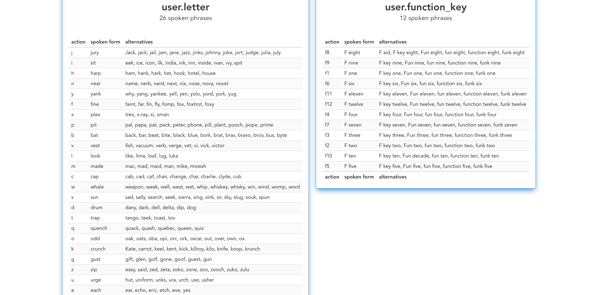

# Stolen Sugar

## Discover Alternative Spoken Phrases for Talon

### About

We steal alternate spoken phrases from the various forks of knausj_talon and make them available to be searched by file.

Stolen Sugar was created by David Slater, Evan Pollak and Ron Walker.

### Website Voice Navigation

You can easily navigate the website with your voice by using the denoted hotkeys. Each hotkey is either a number or letter. If you have not mastered the talon alphabet yet, just say "seven" to look at the cheatsheet. After you link your repository, the entire website, including the cheatsheet, is mapped to your custom spoken phrases.

When you focus on an input element like "File Path", hotkeys are temporarily disabled. Escape or tab to exit input element.

### Repository Search Area

We expect your talon repository to be a publicly available knausj_talon fork, otherwise we don't know it exists. We usually use the default branch. So if you use a different branch, please notify us by submitting an issue.
